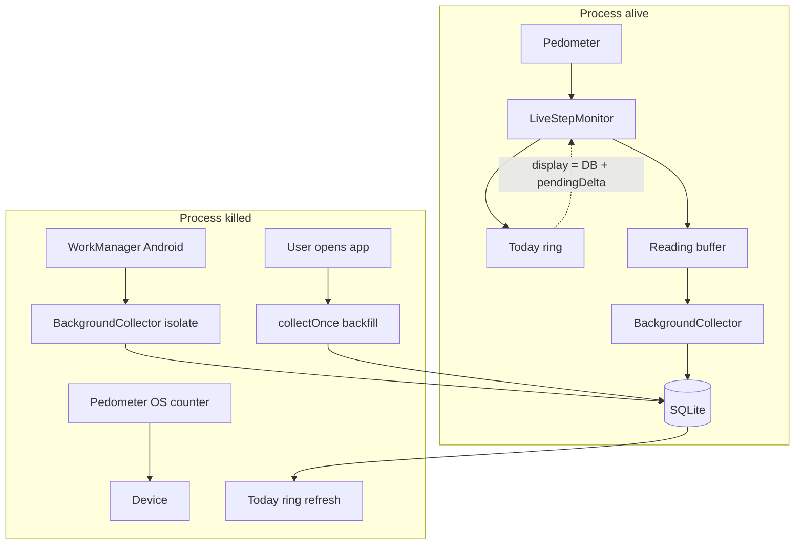

# Background Trust Model & Movement Validation (GPS-Ready)

Companion to [architecture.md](./architecture.md) and [prd.md](./prds/prd-astra-app-2026-05-22/prd.md).  
Answers three product questions raised during Epic 2 live-step work (2026-06-02).

**Audience:** Baptiste, implementers, UX copy, beta checklist.  
**Language:** Planning artifact (English). User-facing strings remain English per NFR-6.

---

## 1. Purpose

Define what ASTRA **promises** vs **does not promise** when:

- The app process is **alive** (foreground or background in RAM),
- The app process is **killed**,
- Future **movement validation** (e.g. GPS) is added to reduce pedometer false positives.

This document preserves **data sovereignty** invariants: local-only, no account, no cloud, no tracking narrative, data minimization.

---

## 2. Non-negotiable invariants (all phases until PRD changes)

| ID | Invariant | Verification |
|----|-----------|--------------|
| S-1 | Health pipeline has **no network** in release builds | Manifest test, `docs/DEPENDENCIES.md` |
| S-2 | **No account**, no silent third-party analytics in health path | Dependency audit, onboarding copy |
| S-3 | User **owns data**: export CSV, purge, footprint on My Data | FR-13, FR-18–21 |
| S-4 | Store **interpretable aggregates** (step buckets), not raw sensor exhaust | PRD §1.2, `timeseries_samples` schema |
| S-5 | **Honest platform UX** — no fake “real-time when app is killed” on iOS | Stale banner, My Data background status |
| S-6 | Only `BackgroundCollector` writes ingestion buckets | Architecture write-path table |

Any GPS or Health Connect work **must** pass S-1 through S-6 before merge.

---

## 3. Two runtime modes

### 3.1 Process alive (foreground or background in RAM)

| Layer | Behavior | User-visible |
|-------|----------|--------------|
| **Live display** | `LiveStepMonitor` owns sole `Pedometer.stepCountStream`; `TodayCubit` subscribes (throttled ~1s) | Step ring updates within ~1–2s while walking |
| **Persist** | Every ~60s: `beginReconcile` → `collectOnce` → `reconcileFromDatabase` (monotonic display floor) | Count should not jump **down** after persist |
| **Stale banner** | Driven by `getLastIngestionUtc()`, not live stream | Steps can update while banner still shows stale until next successful persist |

**Promise:** *While the app process is running, Today shows live step progress without manual refresh.*

**Not promised:** Sub-second per-step updates; perfect rejection of phone shake (pedometer limitation).

### 3.2 Process killed (swipe away / OEM kill)

| Layer | Android (reference) | iOS (secondary) |
|-------|---------------------|-----------------|
| **Live display** | Stops | Stops |
| **OS step counter** | Continues on device | Continues on device |
| **Background ingest** | WorkManager periodic task (`registerStepCollectionWorkmanager` in `main.dart`) — **best effort**, ≥15 min interval, OEM-dependent | No WorkManager parity; opportunistic BGAppRefresh only |
| **On next open** | Cold-start backfill + `AppLifecycleState.resumed` collect | Same backfill model |
| **Honest UX** | Stale compact banner after 12h without ingestion | Stale after 4h |

**Promise:** *Steps are not “lost” from the device; the app catches up on SQLite when collection runs (WM and/or reopen).*

**Not promised:** Live ring updates while app is killed; guaranteed 5-minute background cadence on all Android devices.

---

## 4. Staying “up to date” — layered strategy

Priority order (implement / communicate in this order):

| Priority | Mechanism | Status Phase 0 | Improves |
|----------|-----------|----------------|----------|
| P0 | Live monitor + 60s persist while app alive | **Done** (spec-realtime-step-display + A/B reconcile) | Open-app UX |
| P1 | Foreground backfill (cold start + resume) | **Done** (Story 2.4) | Reopen freshness |
| P2 | WorkManager periodic collect (Android) | **Done** (Story 2.4); device-dependent | Kill-swipe catch-up |
| P3 | Stale banner + My Data background status | **Done** (2.5 / 4.2 partial) | Trust when lagging |
| P4 | Android FGS health + battery/OEM guidance | Epic 4.2 (planned) | Reliable background without cloud |
| P5 | Health Connect / wearable local read | Phase 1+ | Richer sources, still local |
| P6 | iOS BGAppRefresh / HealthKit | Phase 1+ | Narrow iOS gap — document limits |

**Product wording (avoid):** “Real-time steps 24/7 in background.”  
**Product wording (use):** “Steps stay on your device. The Today ring updates live while the app is open. When the app is closed, Android syncs periodically; reopening always refreshes your count.”

---

## 5. Movement validation & GPS (future, sovereignty-safe)

### 5.1 Problem statement

Phone pedometer (`pedometer` plugin) uses accelerometer heuristics:

- **False positives:** shaking desk / hand → step count rises.
- **False negatives:** very slow step cadence → few OS events.

GPS (or fused location) can help **validate movement** only if designed as **ephemeral, on-device signal** — not as continuous tracking.

### 5.2 Allowed design (compatible with S-1–S-6)

| Principle | Requirement |
|-----------|-------------|
| **Optional** | Separate permission flow; never required for basic step counting |
| **Purpose-limited copy** | “Reduce false steps from shaking” — not “track where you go” |
| **On-device only** | Compute movement plausibility in app; **no** lat/long upload |
| **No persistent trail** | Do **not** store GPS coordinates, geohashes, or routes in `timeseries_samples` |
| **Minimization** | Persist at most derived flags or adjusted deltas (e.g. bucket marked `movement_verified: true`) |
| **Ephemeral buffers** | Raw fixes live in memory for current collection window; discard after `collectOnce` |
| **Pipeline fit** | Implement as `DataIngestionSource` helper or pre-normalizer filter — not a parallel write path |

**Example flow (illustrative):**

1. Pedometer emits cumulative counter event.
2. Optional: last-known speed / displacement over 30s from GPS **in RAM** exceeds threshold → accept increment.
3. Else: reject increment for display and bucket (or down-weight).
4. Discard GPS samples; write only step buckets via `BackgroundCollector`.

### 5.3 Forbidden design (breaks trust story)

- Background **always-on** fine location without clear UX justification.
- Storing **history of positions** in SQLite or CSV export.
- Sending location to analytics, maps SDK, or sync hub.
- Marketing “GPS tracking” or route maps in Phase 0 / wellness positioning.
- Coupling GPS permission to onboarding before trust screen explanation.

### 5.4 Sovereignty FAQ (for My Data / onboarding)

| User fear | Honest answer |
|---------|---------------|
| “Will you track me?” | No. No account, no cloud, release app has no internet permission for health data. |
| “Will GPS show my routes?” | Not planned. If we add location, it is only to sanity-check steps on-device; we do not save your path. |
| “What leaves the phone?” | Only what **you** export via share sheet (CSV). |

### 5.5 Phase placement

| Item | Suggested epic | Notes |
|------|----------------|-------|
| Movement plausibility spike (GPS off by default) | Epic 4+ or post-2.x hardening | Behind feature flag |
| `BackgroundHealthCapabilityEvaluator` location capability | Story 4.2 | Permission state only |
| PRD / architecture amendment | Before implementation | Reference this doc |
| Beta checklist row | Epic 6 | “No lat/long in DB export sample” |

---

## 6. Implementation references (current codebase)

| Concern | Location |
|---------|----------|
| Live display | `lib/core/services/live_step_monitor.dart`, `lib/presentation/cubits/today_cubit.dart` |
| Persist cycle | `lib/app.dart` (`_runPersistCycle`, 60s timer) |
| WM background | `lib/core/services/workmanager_callback.dart`, `lib/main.dart` |
| Stale thresholds | `lib/core/health/stale_data_evaluator.dart` (12h Android / 4h iOS) |
| Real-time spec + field fixes A/B | `implementation-artifacts/spec-realtime-step-display.md` |

---

## 7. Beta / QA checklist additions

- [ ] Walk 50 steps with app **open** — ring rises without restart.
- [ ] Background app 2 min (process alive), walk, return — ring reflects new steps.
- [ ] Force-stop app, walk, wait 15+ min (Android) or reopen — total increases after open or WM.
- [ ] After 60s persist while walking — displayed count **does not decrease**.
- [ ] Airplane mode — steps still accumulate locally (FR-18 proof).
- [ ] (Future GPS) Export CSV — **no** latitude/longitude columns.

---

## 8. Decision log

| Date | Decision | Rationale |
|------|----------|-----------|
| 2026-06-02 | Document approved after Epic 2 field feedback | Clarify kill vs alive, set GPS guardrails before Epic 3+ |
| 2026-06-02 | Monotonic reconcile (A) + shared baseline drain (B) | Prevents 271→250 display regression; see spec change log |
| 2026-06-02 | GPS allowed only as ephemeral on-device validator | Preserves CNIL local-only / no-tracking positioning |

---

## 9. Open questions (Baptiste)

| ID | Question | Default if no answer |
|----|----------|----------------------|
| OQ-1 | Target max lag Android when app killed (e.g. 15 vs 30 min)? | Keep WM minimum + honest stale UI |
| OQ-2 | Ship GPS validation in Phase 0 or defer to Phase 1? | **Defer** — pedometer-only until beta proves WM path |
| OQ-3 | User-toggle “strict movement filter” in My Data? | Optional later; off by default |
